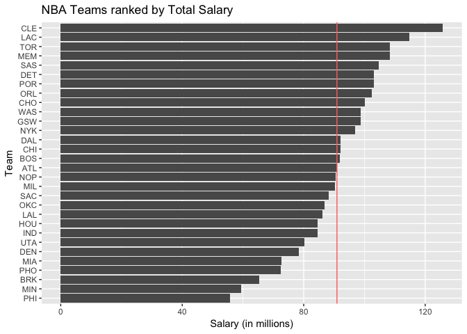
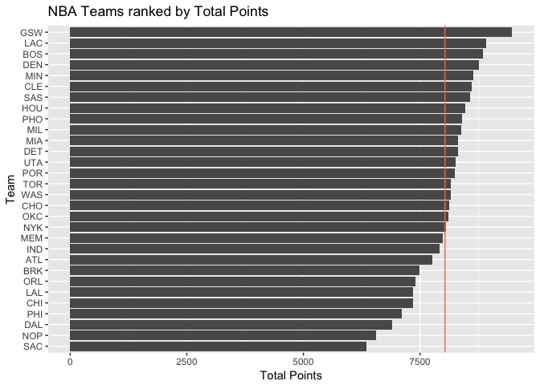
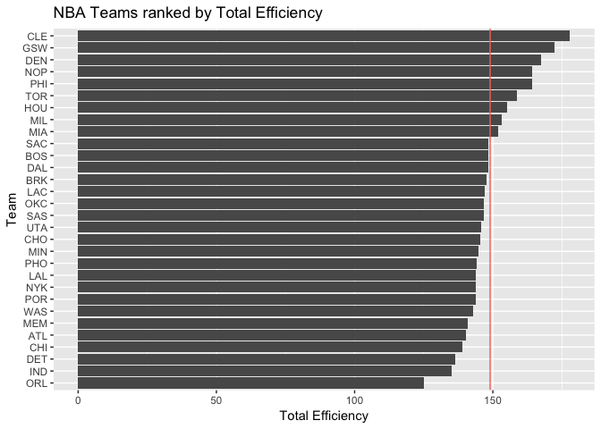
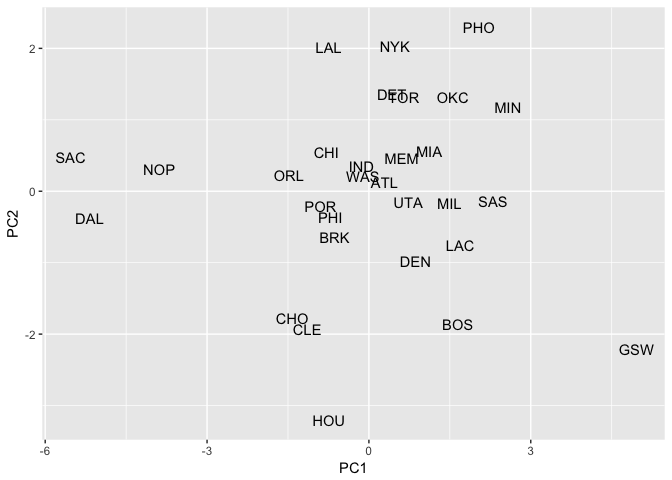

hw03
================

``` r
library(readr)
library(dplyr)
```

    ## Warning: package 'dplyr' was built under R version 3.4.2

    ## 
    ## Attaching package: 'dplyr'

    ## The following objects are masked from 'package:stats':
    ## 
    ##     filter, lag

    ## The following objects are masked from 'package:base':
    ## 
    ##     intersect, setdiff, setequal, union

``` r
library(ggplot2)
roster <- read_csv("../data/nba2017-roster.csv", col_types = cols(
                  position = col_factor(c("C", "PG", "SF", "PF", "SG"))))
stats <- read_csv("../data/nba2017-stats.csv")
```

    ## Parsed with column specification:
    ## cols(
    ##   .default = col_integer(),
    ##   player = col_character(),
    ##   field_goals_perc = col_double(),
    ##   points3_perc = col_double(),
    ##   points2_perc = col_double(),
    ##   points1_perc = col_double()
    ## )

    ## See spec(...) for full column specifications.

``` r
stats <- mutate(stats, 
       missed_fg = field_goals_atts - field_goals_made,
       missed_ft = points1_atts - points1_made, 
       points = 3*points3_made + 2*points2_made + points1_made,
       rebounds = off_rebounds + def_rebounds,
       efficiency = (points + rebounds + assists + steals +
                    blocks - missed_fg - missed_ft - 
                    turnovers) / games_played)

teams <- roster %>% 
  merge(stats)

teams$salary <- round(teams$salary / 1000000, 2)
teams <- teams %>% 
  group_by(team) %>%
  summarise(experience = sum(experience),
            salary = sum(salary),
            points3 = sum(points3_made),
            points2 = sum(points2_made),
            free_throws = sum(points1_made),
            points = sum(points),
            off_rebounds = sum(off_rebounds),
            def_rebounds = sum(def_rebounds),
            assists = sum(assists),
            steals = sum(steals),
            blocks = sum(blocks),
            turnovers = sum(turnovers),
            fouls = sum(fouls),
            efficiency = sum(efficiency))
```

``` r
sorted_salary <- arrange(teams, desc(salary))
sorted_salary
```

    ## # A tibble: 30 x 15
    ##     team experience salary points3 points2 free_throws points off_rebounds
    ##    <chr>      <int>  <dbl>   <int>   <int>       <int>  <dbl>        <int>
    ##  1   CLE        128 125.80    1012    2107        1355   8605          727
    ##  2   LAC        124 114.77     841    2401        1586   8911          740
    ##  3   TOR         57 108.45     626    2359        1570   8166          848
    ##  4   MEM         83 108.34     750    2140        1465   7995          866
    ##  5   SAS         99 104.69     743    2459        1431   8578          821
    ##  6   DET         55 103.07     631    2638        1140   8309          908
    ##  7   POR         43 103.02     852    2156        1386   8254          710
    ##  8   ORL         57 102.40     614    2168        1230   7408          699
    ##  9   CHO         66 100.23     808    2102        1499   8127          634
    ## 10   WAS         56  98.77     671    2417        1316   8163          748
    ## # ... with 20 more rows, and 7 more variables: def_rebounds <int>,
    ## #   assists <int>, steals <int>, blocks <int>, turnovers <int>,
    ## #   fouls <int>, efficiency <dbl>

``` r
ggplot(sorted_salary, aes(x = reorder(team, c(30:1)), y = salary)) +
  geom_bar(stat='identity') +
  coord_flip() + labs(x = "Team", y = "Salary (in millions)") +
  geom_hline(aes(yintercept = mean(sorted_salary$salary), color = "red")) +
  ggtitle("NBA Teams ranked by Total Salary") + theme(legend.position = "none")
```



``` r
sorted_points <- teams %>%
  arrange(desc(points))
sorted_points
```

    ## # A tibble: 30 x 15
    ##     team experience salary points3 points2 free_throws points off_rebounds
    ##    <chr>      <int>  <dbl>   <int>   <int>       <int>  <dbl>        <int>
    ##  1   GSW        101  98.67     982    2540        1447   9473          759
    ##  2   LAC        124 114.77     841    2401        1586   8911          740
    ##  3   BOS         63  91.92     985    2183        1536   8857          744
    ##  4   DEN         74  78.39     868    2347        1471   8769          867
    ##  5   MIN         48  59.38     601    2623        1585   8634          938
    ##  6   CLE        128 125.80    1012    2107        1355   8605          727
    ##  7   SAS         99 104.69     743    2459        1431   8578          821
    ##  8   HOU         56  84.67    1141    1769        1508   8469          766
    ##  9   PHO         68  72.51     564    2551        1605   8399          882
    ## 10   MIL         64  90.27     718    2424        1388   8390          700
    ## # ... with 20 more rows, and 7 more variables: def_rebounds <int>,
    ## #   assists <int>, steals <int>, blocks <int>, turnovers <int>,
    ## #   fouls <int>, efficiency <dbl>

``` r
ggplot(sorted_points, aes(x = reorder(team, c(30:1)), y = points)) +
  geom_bar(stat='identity') +
  coord_flip() + labs(x = "Team", y = "Total Points") +
  geom_hline(aes(yintercept = mean(sorted_points$points), color = "red")) +
  ggtitle("NBA Teams ranked by Total Points") + theme(legend.position = "none")
```



``` r
sorted_eff <- teams %>%
  arrange(desc(efficiency))
sorted_eff
```

    ## # A tibble: 30 x 15
    ##     team experience salary points3 points2 free_throws points off_rebounds
    ##    <chr>      <int>  <dbl>   <int>   <int>       <int>  <dbl>        <int>
    ##  1   CLE        128 125.80    1012    2107        1355   8605          727
    ##  2   GSW        101  98.67     982    2540        1447   9473          759
    ##  3   DEN         74  78.39     868    2347        1471   8769          867
    ##  4   NOP         55  90.63     513    1952        1120   6563          580
    ##  5   PHI         34  55.78     690    1917        1212   7116          673
    ##  6   TOR         57 108.45     626    2359        1570   8166          848
    ##  7   HOU         56  84.67    1141    1769        1508   8469          766
    ##  8   MIL         64  90.27     718    2424        1388   8390          700
    ##  9   MIA         63  72.78     799    2349        1217   8312          857
    ## 10   SAC         68  88.20     558    1838         998   6348          524
    ## # ... with 20 more rows, and 7 more variables: def_rebounds <int>,
    ## #   assists <int>, steals <int>, blocks <int>, turnovers <int>,
    ## #   fouls <int>, efficiency <dbl>

``` r
ggplot(sorted_eff, aes(x = reorder(team, c(30:1)), y = efficiency)) +
  geom_bar(stat='identity') +
  coord_flip() + labs(x = "Team", y = "Total Efficiency") +
  geom_hline(aes(yintercept = mean(sorted_eff$efficiency), color = "red")) +
  ggtitle("NBA Teams ranked by Total Efficiency") + theme(legend.position = "none")
```



``` r
# CLE, LAC, TOR seem to be the highest paying teams, while MIN, PHI, and BRK are the lowest.
# GSW, LAC, BOS seem to score the most points, while DAL, NOP, and SAC score the lowest.
# CLE, GSW, and DEN seem to have the top three efficiency values, while DET, IND, and ORL have the lowest. 
```

``` r
variable <- teams %>%
  select(points3, points2, free_throws, off_rebounds, def_rebounds, assists, steals, blocks, turnovers, fouls)
PCA <- prcomp(variable, scale. = TRUE)
eigenvalues <- data.frame(eigenvalue = round(PCA$sdev^2, 4), prop = round(PCA$sdev^2 / sum(PCA$sdev^2), 4), cumprop = c(0.4696, 0.6398, 0.7377, 0.8149, 0.8683, 0.9161, 0.9543, 0.9804, 0.9937, 1.0000))
eigenvalues
```

    ##    eigenvalue   prop cumprop
    ## 1      4.6959 0.4696  0.4696
    ## 2      1.7020 0.1702  0.6398
    ## 3      0.9795 0.0980  0.7377
    ## 4      0.7717 0.0772  0.8149
    ## 5      0.5341 0.0534  0.8683
    ## 6      0.4780 0.0478  0.9161
    ## 7      0.3822 0.0382  0.9543
    ## 8      0.2603 0.0260  0.9804
    ## 9      0.1336 0.0134  0.9937
    ## 10     0.0627 0.0063  1.0000

``` r
PCA
```

    ## Standard deviations (1, .., p=10):
    ##  [1] 2.1669994 1.3046111 0.9897094 0.8784756 0.7308134 0.6913872 0.6182263
    ##  [8] 0.5101592 0.3655034 0.2503921
    ## 
    ## Rotation (n x k) = (10 x 10):
    ##                    PC1         PC2         PC3          PC4         PC5
    ## points3      0.1121782 -0.65652993  0.28806873 -0.042637313  0.28657624
    ## points2      0.3601766  0.32892544 -0.06763180 -0.347710703 -0.15173866
    ## free_throws  0.3227564 -0.17651228  0.39157491  0.147596178 -0.21363792
    ## off_rebounds 0.3029366  0.35931603  0.33884845 -0.288483019 -0.16571824
    ## def_rebounds 0.3719432 -0.12808273  0.15026131 -0.492969442  0.26476256
    ## assists      0.3125312 -0.44134618 -0.26294129 -0.088066602 -0.36972525
    ## steals       0.3447256 -0.03540585 -0.48554101  0.177578661 -0.33549491
    ## blocks       0.3162237  0.06131890 -0.48869371  0.003935374  0.65459381
    ## turnovers    0.3353958 -0.02169833  0.08910421  0.532117541 -0.04471763
    ## fouls        0.3072548  0.28954426  0.26469871  0.454751471  0.26814214
    ##                       PC6         PC7         PC8         PC9         PC10
    ## points3      -0.028435666  0.38167878  0.18027569 -0.20631322  0.409762462
    ## points2      -0.088714347  0.07302430 -0.47216199 -0.35836740  0.499011524
    ## free_throws  -0.487342521 -0.62732220  0.07726675 -0.08283563 -0.006875686
    ## off_rebounds  0.283093235  0.13535335  0.64646479 -0.14735551 -0.124601143
    ## def_rebounds  0.066309015 -0.04926346 -0.23787252  0.64632050 -0.168579984
    ## assists       0.176019008  0.11785039 -0.18235775 -0.34086739 -0.547385461
    ## steals       -0.303664534  0.25883825  0.32703573  0.41596580  0.246739300
    ## blocks       -0.009954065 -0.30799231  0.23947533 -0.27071160 -0.057627209
    ## turnovers     0.675777660 -0.18850849 -0.14308362  0.13524769  0.250947823
    ## fouls        -0.298848473  0.47268121 -0.21462859 -0.04367200 -0.335087245

``` r
PC1 <- PCA$x[, "PC1"]
PC2 <- PCA$x[, "PC2"]
df_PC1_2 <- data.frame(teams %>% select(team), PC1, PC2)
ggplot(df_PC1_2, aes(x = PC1, y = PC2)) + geom_text(aes(label = team))
```



``` r
scaled_PC1 <- 100 * (PC1 - min(PC1)) / (max(PC1) - min(PC1))
df_scaled <- data.frame(team = teams$team, scaled_PC1 = scaled_PC1)
df_scaled <- df_scaled %>% arrange(desc(scaled_PC1))
df_scaled
```

    ##    team scaled_PC1
    ## 1   GSW 100.000000
    ## 2   MIN  77.280477
    ## 3   SAS  74.645300
    ## 4   PHO  72.163434
    ## 5   LAC  68.862721
    ## 6   BOS  68.432930
    ## 7   OKC  67.554140
    ## 8   MIL  66.968243
    ## 9   MIA  63.359160
    ## 10  DEN  60.950042
    ## 11  UTA  59.690765
    ## 12  TOR  58.891926
    ## 13  MEM  58.511713
    ## 14  NYK  57.304183
    ## 15  DET  56.754305
    ## 16  ATL  55.471897
    ## 17  WAS  51.680440
    ## 18  IND  51.394292
    ## 19  BRK  46.640314
    ## 20  PHI  45.905162
    ## 21  HOU  45.633232
    ## 22  LAL  45.619512
    ## 23  CHI  45.199683
    ## 24  POR  44.174106
    ## 25  CLE  41.824445
    ## 26  CHO  39.169120
    ## 27  ORL  38.580520
    ## 28  NOP  15.660728
    ## 29  DAL   3.357322
    ## 30  SAC   0.000000

``` r
ggplot(df_scaled, aes(x = reorder(team, c(30:1)), y = scaled_PC1)) +
  geom_bar(stat='identity') +
  coord_flip() + labs(x = "Team", y = "First PC (scaled from 0 to 100)") +
  ggtitle("NBA Teams ranked by scaled PC1")
```


``` r
# It seems the GSW by far have the highest PC1 index with MIN having the second highest. SAC on the other hand has the lowest PC1 index. DAL and NOP also have noticeably low PC1 indexes.
```
