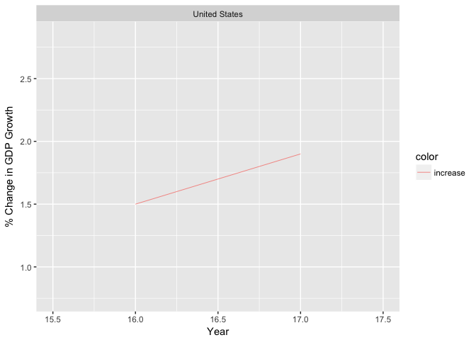
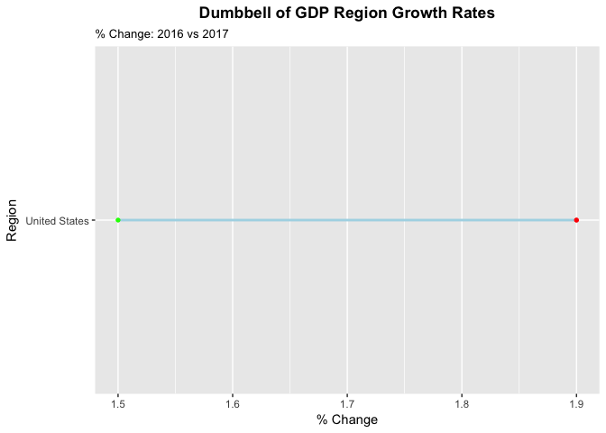
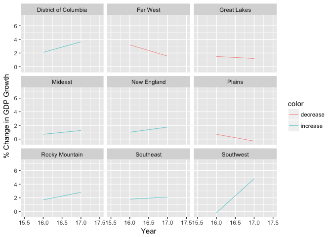
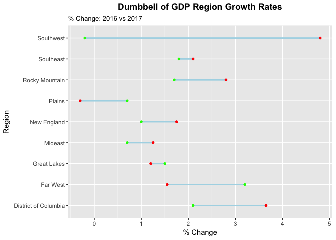
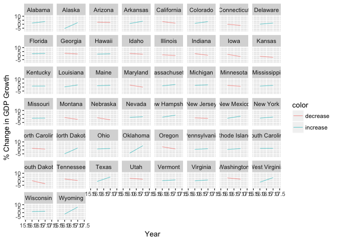
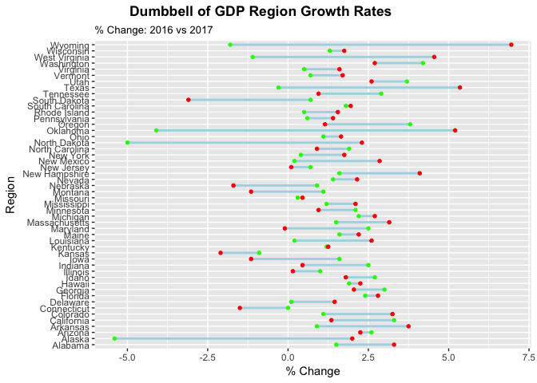

The Versatility of Data Visualization
================

Background
----------

The possibilities of data visualization are endless. It is amazing the extent of methods there are to represent data and showcase them in a way that best illustrates connections or significant findings. They can range from simple scatter plots, bar plots, and histograms to more complex graphs such as slope graphs, heat maps, correlograms, horizon charts, and alluvial diagrams to name a few. All these charts may seem like they tell the same story; however, most of these methods have stark differences that are best used in specific scenarios.

Motivation
----------

Just reading several news articles, many media giants are utilizing such statistical modeling software to keep up with the massive amounts of data they have. This ongoing trend is exactly the reason more people should be aware of such powerful tools to visualize data. Not only will it help companies to understand consumer data, but also it benefits individuals in the way that they may more deeply understand the world around them. Much of this post will be discussing a few data visualization methods that were not discussed in Stat 133, though there are several concepts that need to be understood from class in order to fully create better visualization tools in R. This includes knowing which packages to install and load so that the user may load data from a .csv file and be able to wrangle data to give clean data to model with.

U.S. GDP Growth Rates
---------------------

Now to begin, we will look at data about the United States economy GDP growth rates. We will start from the most comprehensive data point by looking at the overall U.S. GDP growth. For this example, load the ggplot2, dplyr, and readr packages to easily import data, wrangle data, and ultimately visualize data.

Download the file from the Bureau of Economic Analysis [here](https://www.bea.gov/newsreleases/regional/gdp_state/qgsp_newsrelease.htm).

You will notice that the data is very raw and in order for it to be imported as a data frame in RStudio, the .csv file needs to be manually cleaned up by following the criteria of the first row must be for column names. All rows beneath that must be respective data points for GDP Growth, Location. For the sake of this analysis, also make sure that an Area column is added so that we can later dissect the GDP Growth rates into regions and then states.

We will compute the average for 2017’s growth rate. Now, select the columns that include Locations, Area, avg\_2016, avg\_2017.

``` r
#Importing data and data wrangling
library(ggplot2)
library(dplyr)
```

    ## Warning: package 'dplyr' was built under R version 3.4.2

    ## 
    ## Attaching package: 'dplyr'

    ## The following objects are masked from 'package:stats':
    ## 
    ##     filter, lag

    ## The following objects are masked from 'package:base':
    ## 
    ##     intersect, setdiff, setequal, union

``` r
library(readr)
gdp <- read_csv(file = "./gdp-data.csv")
```

    ## Parsed with column specification:
    ## cols(
    ##   Locations = col_character(),
    ##   Area = col_character(),
    ##   avg_2016 = col_double(),
    ##   Q1_2016 = col_double(),
    ##   Q2_2016 = col_double(),
    ##   Q3_2016 = col_double(),
    ##   Q4_2016 = col_double(),
    ##   Q1_2017 = col_double(),
    ##   Q2_2017 = col_double()
    ## )

``` r
gdp <- gdp %>% mutate(avg_2017 = (Q1_2017 + Q2_2017) / 2)
gdp <- gdp %>% select(Locations, Area, avg_2016, avg_2017)
gdp
```

    ## # A tibble: 60 x 4
    ##        Locations   Area avg_2016 avg_2017
    ##            <chr>  <chr>    <dbl>    <dbl>
    ##  1 United States  Total      1.5     1.90
    ##  2   New England Region      1.0     1.75
    ##  3   Connecticut  State      0.0    -1.50
    ##  4         Maine  State      1.6     2.20
    ##  5 Massachusetts  State      1.5     3.15
    ##  6 New Hampshire  State      1.6     4.10
    ##  7  Rhode Island  State      0.5     1.55
    ##  8       Vermont  State      0.7     1.70
    ##  9       Mideast Region      0.7     1.25
    ## 10      Delaware  State      0.1     1.45
    ## # ... with 50 more rows

Use filter on gdp so that only data for the entire United States GDP Growth Rates appear and add a column that represents whether the growth is increasing or decreasing from 2016 to 2017.

``` r
#Categorize by the United States GDP
gdp_total <- gdp %>% filter(Area == "Total")

#Set the color for negative vs postive GDP Changes
gdp_total$color <- ifelse((gdp_total$avg_2017 - gdp_total$avg_2016) < 0,"decrease", "increase")
gdp_total
```

    ## # A tibble: 1 x 5
    ##       Locations  Area avg_2016 avg_2017    color
    ##           <chr> <chr>    <dbl>    <dbl>    <chr>
    ## 1 United States Total      1.5      1.9 increase

Use ggplot and incorporate geom\_segment to plot a line that charts out the change in the GDP growth rates from 2016 to 2017.

``` r
#Plot graphs
p <- ggplot(gdp_total) + geom_segment(aes(x=16, xend=17, y=avg_2016, yend=avg_2017, 
                                     col = color),size = 0.25) + 
  facet_wrap(~ Locations) + 
  
#X,Y Labels
  labs(x="Year", y="% Change in GDP Growth") + 
  
#X,Y axis limits
  xlim(15.5, 17.5) + 
  ylim(.5*(min(gdp_total$avg_2016, gdp_total$avg_2017)), 
       (1.5*(max(gdp_total$avg_2016, gdp_total$avg_2017)))) 
p
```



Now use ggplot to plot a dumbbell chart with geom\_dumbbell. This graph shows the percent change of the growth rates on a horizontal line.

``` r
library(ggalt)

p2 <- ggplot(gdp_total, aes(x = gdp_total$avg_2016, xend = gdp_total$avg_2017, 
                             y = gdp_total$Locations, group = gdp_total$Locations)) + 
  #Dumbbell type graph
        geom_dumbbell(color = "light blue", 
                      size = 1, colour_x = "green", colour_xend = "red") + 
  #Labels
        labs(x="% Change", y="Region", title="Dumbbell of GDP Region Growth Rates", 
             subtitle="% Change: 2016 vs 2017") +
  #Graph layout
        theme(plot.title = element_text(hjust=0.5, face="bold"),
              panel.grid.major.x=element_line(),
              panel.border=element_blank())
p2
```



Not export the file so that this graph may be of use to your team at work or to share amongst colleagues.

``` r
#Output data to a .pdf file
p
```


``` r
ggsave(filename = "gdp-united-states-growth.pdf", width = 7, height = 5)
p2
```


``` r
ggsave(filename = "gdp-united-states-dumbbell.pdf", width = 7, height = 5)
```

Now that we have achieved a basic application for this visualization method with the United States GDP growth rate, we can move on to the growth rate changes of the greater regions. We use filter to only get data that describes a region. We also use arrange to sort the Locations in alphabetical order so that it is easier to read the graphs and we label whether the rates are increasing or decreasing.

``` r
#Categorize by Region GDP
gdp_region <- gdp %>% filter(Area == "Region")

#Sort regions by alphabetical order
gdp_region <- gdp_region %>% arrange(Locations)

#Set the color for negative vs postive GDP Changes
gdp_region$color <- ifelse((gdp_region$avg_2017 - gdp_region$avg_2016) < 0, "decrease", "increase")
gdp_region
```

    ## # A tibble: 9 x 5
    ##              Locations   Area avg_2016 avg_2017    color
    ##                  <chr>  <chr>    <dbl>    <dbl>    <chr>
    ## 1 District of Columbia Region      2.1     3.65 increase
    ## 2             Far West Region      3.2     1.55 decrease
    ## 3          Great Lakes Region      1.5     1.20 decrease
    ## 4              Mideast Region      0.7     1.25 increase
    ## 5          New England Region      1.0     1.75 increase
    ## 6               Plains Region      0.7    -0.30 decrease
    ## 7       Rocky Mountain Region      1.7     2.80 increase
    ## 8            Southeast Region      1.8     2.10 increase
    ## 9            Southwest Region     -0.2     4.80 increase

We use ggplot with geom\_segment again except with gdp\_region.

``` r
#Plot graphs
p <- ggplot(gdp_region) + geom_segment(aes(x=16, xend=17, y=avg_2016, yend=avg_2017, 
                                     col = color),size = 0.25) + 
  facet_wrap(~ Locations) + 
  
#X,Y Labels
  labs(x="Year", y="% Change in GDP Growth") + 
  
#X,Y axis limits
  xlim(15.5, 17.5) + 
  ylim(1.5*(min(gdp_region$avg_2016, gdp_region$avg_2017)), 
       (1.5*(max(gdp_region$avg_2016, gdp_region$avg_2017)))) 
p
```



Use geom\_dumbbell with gdp\_region now.

``` r
library(ggalt)

p2 <- ggplot(gdp_region, aes(x = gdp_region$avg_2016, xend = gdp_region$avg_2017, 
                             y = gdp_region$Locations, group = gdp_region$Locations)) + 
  #Dumbbell type graph
        geom_dumbbell(color = "light blue", 
                      size = 1, colour_x = "green", colour_xend = "red") + 
  #Labels
        labs(x="% Change", y="Region", title="Dumbbell of GDP Region Growth Rates", 
             subtitle="% Change: 2016 vs 2017") +
  #Graph layout
        theme(plot.title = element_text(hjust=0.5, face="bold"),
              panel.grid.major.x=element_line(),
              panel.border=element_blank())
p2
```



``` r
#Output data as .pdf file
p
```


``` r
ggsave(filename = "gdp-regions-growth.pdf", width = 15, height = 10)
p2
```


``` r
ggsave(filename = "gdp-regions-dumbbell.pdf", width = 15, height = 10)
```

To go even further, we will now investigate the changes in GDP growth rates at the individual states level by using filter to extract only information pertaining to states; the same methodology for the United States and regions is used for the states as well.

``` r
#Categorize by State GDP
gdp_state <- gdp %>% filter(Area == "State")

#Sort States in alphabetical order
gdp_state <- gdp_state %>% arrange(Locations)

#Set the color for negative vs postive GDP Changes
gdp_state$color <- ifelse((gdp_state$avg_2017 - gdp_state$avg_2016) < 0,"decrease", "increase")

gdp_state
```

    ## # A tibble: 50 x 5
    ##      Locations  Area avg_2016 avg_2017    color
    ##          <chr> <chr>    <dbl>    <dbl>    <chr>
    ##  1     Alabama State      1.5     3.30 increase
    ##  2      Alaska State     -5.4     2.00 increase
    ##  3     Arizona State      2.6     2.25 decrease
    ##  4    Arkansas State      0.9     3.75 increase
    ##  5  California State      3.3     1.35 decrease
    ##  6    Colorado State      1.1     3.25 increase
    ##  7 Connecticut State      0.0    -1.50 decrease
    ##  8    Delaware State      0.1     1.45 increase
    ##  9     Florida State      2.4     2.80 increase
    ## 10     Georgia State      3.0     2.05 decrease
    ## # ... with 40 more rows

``` r
#Plot graphs
p <- ggplot(gdp_state) + geom_segment(aes(x=16, xend=17, y=avg_2016, yend=avg_2017, 
                                     col = color),size = 0.25) + 
  facet_wrap(~ Locations) + 
  
#X,Y Labels
  labs(x="Year", y="% Change in GDP Growth") + 
  
#X,Y axis limits
  xlim(15.5, 17.5) + 
  ylim(1.5*(min(gdp_state$avg_2016, gdp_state$avg_2017)), 
       (1.5*(max(gdp_state$avg_2016, gdp_state$avg_2017))))  

p
```



Use geom\_dumbbell on gdp\_state.

``` r
library(ggalt)

p2 <- ggplot(gdp_state, aes(x = gdp_state$avg_2016, xend = gdp_state$avg_2017, 
                             y = gdp_state$Locations, group = gdp_state$Locations)) + 
  #Dumbbell type graph
        geom_dumbbell(color = "light blue", 
                      size = 1, colour_x = "green", colour_xend = "red") + 
  #Labels
        labs(x="% Change", y="Region", title="Dumbbell of GDP Region Growth Rates", 
             subtitle="% Change: 2016 vs 2017") +
  #Graph layout
        theme(plot.title = element_text(hjust=0.2, face="bold"),
              panel.grid.major.x=element_line(),
              panel.border=element_blank())
p2
```



``` r
#Output data as .pdf file
p
```


``` r
ggsave(filename = "gdp-states-growth.pdf", width = 17, height = 12)
p2
```


``` r
ggsave(filename = "gdp-states-dumbbell.pdf", width = 17, height = 12)
```

Discussion about the United States GDP Growth Rate
--------------------------------------------------

Making graphs is nice and all and rightfully so as they are powerful ways to view data; however, what good are these charts if we as statisticians, students, analysts, and individuals don't make use of them to make an impact in some form or another. Instead of being caught up in all the qualitative discussion on the news, statistics software, such as what we have done above, enables us to look at a situation quantitatively and make calculated judgements and decisions. Taking the example we just did, we are able to view the performance of the U.S. Economy in three different levels: national, regional, statewide. This versatility of data visualization helps us learn more about the world and hopefully allows us to see problems where there are some.

Limitations
===========

Most of what is said above speaks highly of data visualization; however, there is only so much these tools can help us model about the world. Much of this analysis has all been done on historical data. Statistics may try to predict the future but there is so much variability and factors in the world that humans just simply cannot do so.

Future Trends in this Field
---------------------------

As said in the press, big data is becoming a huge thing in the corporate world. Any type of service we use has our usage data logged into it. Society has seen a gradual shift towards a data dependent economy. Software such as [Tableau](https://www.tableau.com/) help make this possible. Companies such as this take massive amounts of data and give firms useful insights on how to profit off customers. Alhtough this has become a reality, this phenomenon also gives individuals the power to make impactful decisions such as applying this tool to environmental degradation, wealth inequality, and even public health concerns to name a few. So, with what this post has hopefully taught you, the capabilities for charting out data can only better help your understanding of the world. Who knows, maybe data that you see in the future shows inefficiencies that you can solve.

References
----------

<https://www.r-bloggers.com/7-visualizations-you-should-learn-in-r/>

<https://medium.com/@EvanSinar/7-data-visualization-types-you-should-be-using-more-and-how-to-start-4015b5d4adf2>

<https://www.npr.org/2015/09/10/319535020/coal-gas-nuclear-hydro-how-your-state-generates-power>

<http://r-statistics.co/Top50-Ggplot2-Visualizations-MasterList-R-Code.html#Animated%20Bubble%20Plot>

<https://www.bea.gov/newsreleases/regional/gdp_state/qgsp_newsrelease.htm>

<https://www.forbes.com/sites/dorieclark/2014/03/10/data-visualization-is-the-future-heres-why/#10e97eff1884>

<https://www.forbes.com/sites/petercohan/2017/11/16/startup-thoughtspots-160m-aimed-at-tableau-software-in-70b-market/#132525775e34>

<https://www.huffingtonpost.com/entry/the-7-best-data-visualization-tools-in-2017_us_59afd0d7e4b0c50640cd634b>
